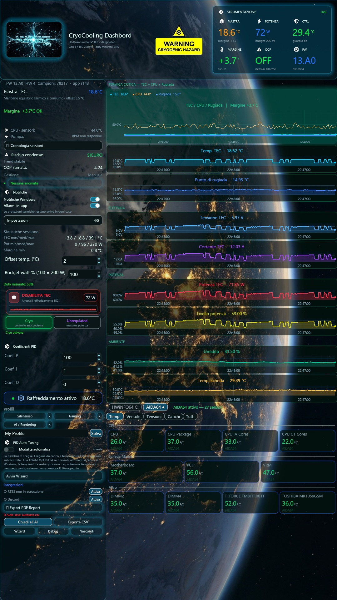
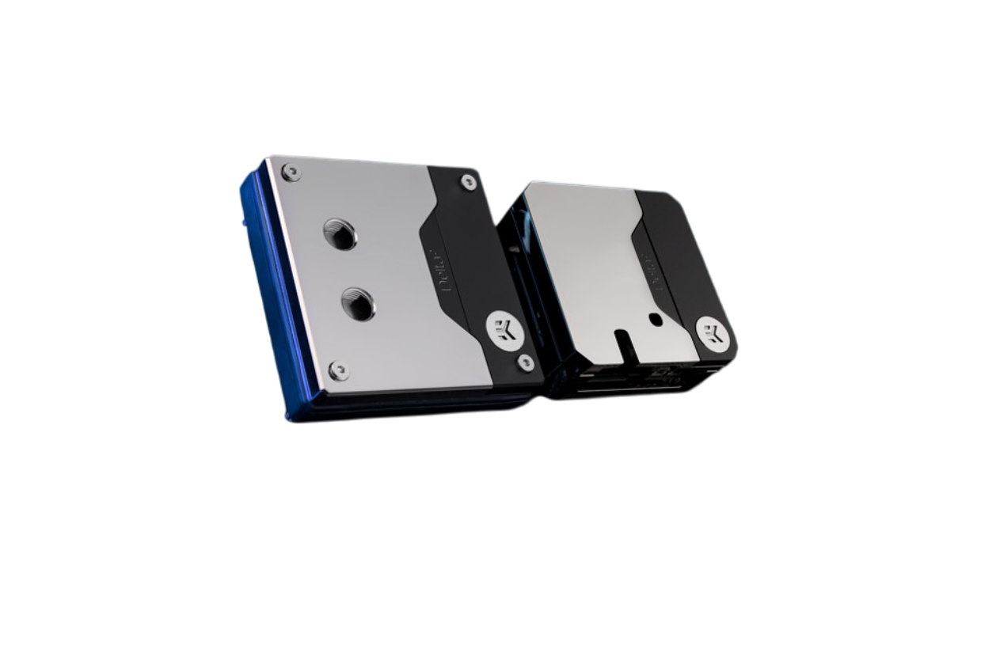
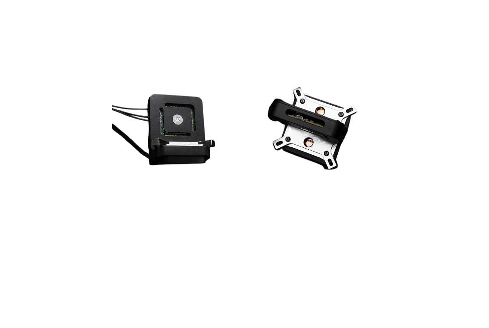
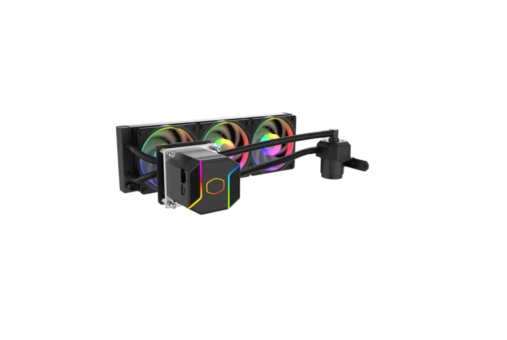

# Dashboard for Intel® Cryo Cooling Technology

> Software alternativo di controllo per cooler TEC basati su **Intel Cryo Cooling Technology**.
> Funziona con **qualsiasi CPU**, non solo con le 23 elencate nel software ufficiale.

[](LICENSE)
[](https://www.rust-lang.org)
[](https://iced.rs)
[](docs/reverse-engineering/cryo-gen1.md)
[](#compilazione)
[](SECURITY.md)



*Screenshot reale: dashboard `r143` su controller **Intel Cryo Gen 1** (`HW 4`, `FW 13.A0`) con cella
**EK-Quantum Delta² TEC V2** montata. 78.217 campioni, TEC a 18,6 °C, 71,85 W misurati, duty 53 %,
margine di condensa +3,7 °C.*

---

## Indice

1. [Il problema](#il-problema)
2. [Su quali CPU funziona](#su-quali-cpu-funziona)
3. [Controller supportati](#controller-supportati)
4. [La modalita non e un comando seriale](#la-modalita-non-e-un-comando-seriale)
5. [Cosa fa la dashboard](#cosa-fa-la-dashboard)
6. [Configurazione](#configurazione)
7. [Risultati misurati](#risultati-misurati)
8. [Cosa NON fa e cosa NON è dimostrato](#cosa-non-fa-e-cosa-nonè-dimostrato)
9. [Il protocollo in breve](#il-protocollo-in-breve)
10. [Architettura](#architettura)
11. [Sicurezza hardware](#sicurezza-hardware)
12. [Versione Linux in arrivo](#versione-linux-in-arrivo)
13. [Compilazione](#compilazione)
14. [Documentazione](#documentazione)
15. [Crediti](#crediti)

---

## Il problema

Il software ufficiale Intel è chiuso e **non parte** su quasi tutte le CPU moderne.

L'installer contiene uno script WMI che confronta il nome del processore con una lista di **23 modelli,
tutti di 10ª generazione**:

```vbscript
CPUList = Array("10900K", "10850K", ..., "9900KS", "9700KF")
Set SearchObj = GetObject("WinMgmts:").instancesof("Win32_Processor")
' ~40 Replace() eliminano Intel(R), Core(TM), i9, -, @, GHz, MHz, Edition...
' poi il confronto è per TESTO ESATTO
```

Su una CPU di 14ª generazione il confronto fallisce e l'applicazione si rifiuta di avviarsi:
*"This cooling solution is not supported on this processor."*

Il blocco **non è un bug**: è la condizione prevista dal produttore. Ed è anche inutile come blocco,
perché quel software **non imposta la modalità di raffreddamento**, come si vede sotto.

Questa dashboard fa il lavoro che serve davvero: regolazione del freddo, PID, potenza, temperature,
margine di condensa, diagnostica e stato del controller. Su **qualsiasi CPU**.

---

## Su quali CPU funziona

**La ragione tecnica è una sola: questa dashboard non legge mai il modello della CPU.**

Non installa il pacchetto Intel, non esegue lo script WMI, non confronta nessuna stringa. Apre la
porta seriale e parla il protocollo del controller. Non esiste un punto nel codice in cui il
processore viene interrogato per decidere se l'applicazione può partire.

| CPU | Perché funziona |
|---|---|
| **Intel 10ª, 11ª, 12ª generazione** | le uniche che il software ufficiale accetta, quindi il caso triviale |
| **Intel 13ª e 14ª generazione** | il blocco del produttore non esiste più: qui non c'è allowlist |
| **AMD** (AM4, AM5, LGA1700) | il controller TEC è indipendente dal vendor della CPU. Il punto debole sarebbe il PID, risolto sotto |
| **Qualsiasi CPU che si riesca a modificare e montare il sistema** | ingegneria campione, microcode modificato, BIOS sbloccato, CPU con FUSE aperti: se il sistema parte e la cella TEC è montata, il controller non chiede chi sei |

### La temperatura della CPU nel PID

Il regolatore ha bisogno della temperatura della CPU per correggere il freddo. Il controller la
riceve con l'opcode `0x19` (`setCpuTemp`), e su una CPU che il produttore non conosce non avrebbe
una fonte valida.

La dashboard la legge da **due sorgenti indipendenti dal vendor**, selezionabili a runtime:

| Sorgente | Interfaccia | Note |
|---|---|---|
| **HWiNFO64** | shared memory `Global\HWiNFO_SENS_SM2` | da abilitare in *Settings → General → Shared Memory Support* |
| **AIDA64** | shared memory `Global\AIDA64_SensorValues`, formato XML | 27 sensori nello screenshot di riferimento |

Entrambe funzionano su Intel e su AMD, quindi il PID riceve la temperatura reale su qualsiasi
processore. A parità di priorità viene scelto il **sensore più caldo**, e i sensori **die/core**
hanno la precedenza sulla lettura generica della CPU: con la CPU che scaldava il TEC, la media dei
core dice meno del core hotter.

**Senza HWiNFO né AIDA64** il ciclo funziona comunque, ma il controller usa il suo **sensore NTC
interno** e regola sulla temperatura della piastra invece che su quella della CPU. Il
funzionamento è corretto, la risposta al carico è più lenta.

---

## Controller supportati

| Configurazione | Stato |
|---|---|
| **Controller Intel Cryo Gen 1** (`HW 4`, firmware `13.A0`) | **collaudato** su tutto il percorso R1 → R13 |
| **Cella TEC Gen 2 montata su controller Gen 1** | **collaudata**: è la combinazione usata in questo progetto, riportata in testata come `Gen 1 / TEC 2 attive` |
| **Controller Intel Cryo Gen 2** | non collaudato qui. Stesso protocollo e stessi 26 opcode, ma **le costanti di potenza vanno rimisurate**: il Gen 2 regge più corrente e i valori copiati dal Gen 1 non valgono |

Il Gen 1 eroga in modo misurato **220 / 230 / 237 W** con raffreddamento regolare, ben oltre
l'etichetta "200 W" del kit. Sul Gen 2 quel numero non è trasferibile.

Sul lato software non c'è distinzione tra Gen 1 e Gen 2: gli opcode sono gli stessi e la
differenza è nel firmware, non nel protocollo.

### Le celle supportate

<table>
<tr>
<td align="center" width="33%"></td>
<td align="center" width="33%"></td>
<td align="center" width="33%"></td>
</tr>
<tr>
<td align="center"><strong>EK-Quantum Delta² TEC D-RGB</strong><br>EK &middot; Delta TEC 2</td>
<td align="center"><strong>EK-QuantumX Delta TEC EVO</strong><br>EK &middot; Delta TEC 1</td>
<td align="center"><strong>MasterLiquid ML360 SUB-ZERO EVO</strong><br>Cooler Master &middot; 360 mm</td>
</tr>
<tr>
<td align="center">**Collaudata** su questo controller<br>LGA1700</td>
<td align="center">Compatibile<br>non collaudata qui</td>
<td align="center">Compatibile<br>non collaudata qui</td>
</tr>
</table>

La **Delta² TEC D-RGB** è la cella usata in tutto il collaudo R1 → R13: le misure di questo
documento, il carico di 225 W a COP stimato 0,95 e la stabilizzazione a 112 W a COP 1,70 vengono
tutti da lì.

Il protocollo non cambia da una cella all'altra: cambiano i **limiti elettrici**, che vanno
rimisurati su ogni combinazione. I valori di corrente e potenza della Delta² non sono
trasferibili a un'altra cella, e il documento sull'ottimizzazione dice esplicitamente cosa fare
prima di fidarsi.

Le immagini sono rendering ufficiali dei produttori, usati per uso nominativo. Condizioni in
[`TRADEMARKS.md`](TRADEMARKS.md).

### Lista completa dei cooler supportati

| Cooler | Produttore | Stato qui |
|---|---|---|
| **EK-Quantum Delta² TEC D-RGB** | EK | **collaudato**, LGA1700 |
| **EK-QuantumX Delta TEC EVO** | EK | compatibile |
| **MasterLiquid ML360 SUB-ZERO** | Cooler Master | compatibile |
| **MasterLiquid ML360 SUB-ZERO EVO** | Cooler Master | compatibile |

---

## La modalita non e un comando seriale

> **Non esiste un opcode "cambia modalità".**

`IntelCryoCooling.Controller.dll` espone due scritture: `SetLowPowerMode` e `SetTemperatureSensorMode`.
**Non c'è `SetMode`.** Nessuno dei 16 moduli estratti contiene le stringhe `Unregulated`, `Standby` o
`Cryo mode`: la modalità non passa dalla seriale.

La modalità è lo **stato di un pin GPIO**, letto e scritto dal driver `CCHWApiExt.sys`
(`kHWAPIReadGPIO` / `kHWAPIWriteGPIO`) e da `TATInterface.dll` (`MMIOReadGPIO` / `MMIOWriteGPIO`).
**Chi sceglie la modalità è l'hardware**, in base al carico della CPU:

| Carico CPU | Comportamento del controller |
|---|---|
| **< 25 W** per > 10 minuti | l'Unregulated viene sospeso → torna a **Cryo** |
| **> 25 W** per > 10 minuti | l'Unregulated **continua** |

Il software Intel *legge* la modalità invece di impostarla: `Cooler is in standby mode` è un
messaggio di stato. Su quel canale non esiste un comando di commutazione, quindi non è possibile
aggiungere un interruttore.

### Come si ottiene un regime

Il regime si ottiene **scrivendo il setpoint offset e poi abilitando il controller**. Il regime è una
*conseguenza* di quei due comandi:

```
SetSetPointOffset(offset)   opcode 0x14, float32 LE
SetLowPowerMode(bool)       opcode 0x18  →  [0,0,0,0] accende · [1,0,0,0] spegne
GetBoardStatus()            opcode 0x00  →  per CONFERMARE il regime
```

I valori dei profili sono stati trovati in `Intel.CryoCooling.Configuration.dll`, dentro getter che
restituiscono un `float` costante (IL verificato: `ldarg.0; ldc.r4 -30.0; ret`):

| Offset | Regime | Comandi |
|---|---|---|
| setpoint utente | **Cryo** | `0x14`, `0x18 [0,0,0,0]` |
| **`-30.0`** | **Unregulated** | `0x14`, `0x18 [0,0,0,0]` |
| **`3.5`** | **Standby** | `0x14`, `0x18 [0,0,0,0]` |
| nessun offset | **Spento** | `0x18 [1,0,0,0]` *(solo: nessun `0x14`)* |

> **Perché "Spento" non scrive `0x14`**: su questo bus ogni byte in più può essere il reset di
> fabbrica (`0x1E`), e un controller spento non applica comunque un setpoint. Le impostazioni restano
> memorizzate perché lo spegnimento non è un reset.

Dettaglio completo dell'analisi: [`docs/reverse-engineering/cryo-gen1.md`](docs/reverse-engineering/cryo-gen1.md).

---

## Cosa fa la dashboard

| Area | Funzioni |
|---|---|
| **Controllo** | Offset setpoint, PID (P/I/D), budget in watt, duty letto, enable/disable con ACK e readback |
| **Regimi** | Cryo · Unregulated (offset `-30`) · Standby · Spento, con **dialogo unico** e conferma di regime |
| **Sicurezza** | guardia anticondensa sul margine `TEC − rugiada`, guardia termica controller, watchdog con disable reale, OCP come **segnale da controllare** (non azione automatica) |
| **Misure** | piastra, punto di rugiada, umidità, tensione, corrente, watt, duty, temperatura scheda, 14 bit di stato grezzi |
| **Sensori** | HWiNFO64 shared memory e AIDA64, entrambi selezionabili a runtime; priorità ai sensori die/core |
| **Grafici** | 8 grafici su asse temporale condiviso, interpolazione 1 s, cache geometria, ~30 fps, stop automatico in Home e nel tray |
| **Profili** | 3 preset (Silenzioso 60 W / Gaming 120 W / AI 160 W) + profili personali, isteresi ±0,75 °C |
| **Test** | **320 test passanti** (297 applicazione + 23 libreria), verificati con `cargo test --workspace`; 5 test di integrazione intenzionalmente ignorati perché richiedono hardware collegato o scrivono sul database reale |
| **Diagnostica** | 2 problemi reali, storico min/avg/max di sessione, COP **etichettato come stima**, log `tec-controller.log` |
| **Dati** | export CSV su Desktop, auto-save CSV ogni 5 min, report PDF, storico sessioni SQLite |
| **Continuità** | supervisore che riavvia dopo crash, riattiva **solo** Cryo se era stato richiesto, backoff fino a 30 s, `recovery.log` |
| **Integrazioni** | AI Advisor (modello via `ANTHROPIC_API_KEY` da env), RTSS overlay, Discord, PID Auto-Tuning wizard |

### Layout per monitor verticali


Progettato per **1080×1920 e simili**: sidebar fissa a sinistra (≈26 %) con strumentazione, controlli,
PID, profili e integrazioni; colonna destra fluida con 8 grafici impilati su **asse temporale condiviso**
e pannello sensori a 27 canali in basso. Card scure traslucide sopra un'immagine full-bleed,
separazione 8 px, badge `CRYOGENIC HAZARD` sempre visibile in testata.

---

## Configurazione

Nessun parametro di gestione TEC è fissato nel codice. Ogni valore elencato qui è un campo
pubblico, modificabile a runtime e persistito.

| Livello | Parametri configurabili | Sorgente |
|---|---|---|
| **Profilo** | nome, coefficiente P, coefficiente I, coefficiente D, setpoint, budget in watt | `config.rs`, struct `Profile` |
| **Setpoint** | offset libero da **-30.0 a +50.0 °C** | `config.rs`, clamp sui profili personali |
| **Preset** | 3 di fabbrica (Silenzioso, Gaming, AI / Rendering) più **profili personali** con nome libero | `config.rs`, `default_idle`, `default_gaming`, `default_ai_workload` |
| **Margine di sicurezza** | 6,0 °C su Idle, 3,5 °C su Gaming, 3,0 °C su AI. Ogni profilo può avere il proprio | `config.rs`, `con_margine_sicuro()` |
| **AutoProfiler** | `usa_carico`, `usa_temp`, `soglia_temp`, `soglia_carico`, `soglia_leggero` | `automanager.rs`, struct `Config` |
| **Isteresi del regolatore** | ±0,75 °C, passo offset 0,5 °C, attesa 30 s per valutare, pausa 120 s dopo un aumento inutile | regolatore TEC |
| **Budget in watt** | percentuale 0 – 100, dove 100 % = 200 W. Modificabile durante la sessione | `running.rs` |
| **Coefficienti PID** | P, I, D liberi. Il preset in uso è 100 / 1 / 0, già provato su questo hardware | `commutazione.rs`, `attore_tec.rs` |
| **Regimi** | Cryo, Unregulated (offset -30), Standby (offset 3.5), Spento. Il regime corrente viene **confermato** dal controller | `commutazione.rs` |
| **PID Auto-Tuning** | wizard guidato che misura la risposta del controller e propone i guadagni, con verifica seriale | `pid_wizard.rs` |
| **Regole di allarme** | canale, condizione, etichetta, stato di attivazione, cooldown in secondi | `alerts.rs`, struct `AlertRule` |
| **Notifiche** | toast Windows, banner in-app, log su disco | `config.rs`, struct `NotifySettings` |
| **Sorgente sensori** | HWiNFO64 oppure AIDA64, selezionabile a runtime | `hwinfo.rs`, `SensorSource` |

I profili vivono in `%APPDATA%\StargateLabsCryo\config.json` e vengono salvati e ricaricati senza
perdita. I tre preset hanno nomi riservati: al caricamento vengono applicati i valori nuovi anche se
la configurazione contiene la versione precedente, mentre i profili personali con nomi diversi
conservano il proprio offset.

Il regolatore agisce **solo in Cryo**. Unregulated resta una scelta manuale con rischio di condensa
dichiarato, e caricare un profilo non la riattiva da sola.

---

## Risultati misurati

Su questo hardware (controller Gen 1, cella TEC V2, misure in regime):

| Regime | Tensione | Corrente | Potenza | Piastra | Rugiada | COP stimato |
|---|---|---|---|---|---|---|
| 86 % | 10,38 V | 21,70 A | **225 W** | 8,2 °C | 15,01 °C | **0,95** |
| ~48 % | non rilevato | non rilevato | **112 W** | non rilevato | non rilevato | **1,70** |

**Metà watt per COP quasi doppio.** Il radiatore riceve molto meno calore. Questo è il risultato
centrale del lavoro: *a parità di freddo, il punto di funzionamento più basso consuma meno e scalda meno*.

### Misure in conflitto con le prime ipotesi

| Ipotesi iniziale | Verdetto | Evidenza |
|---|---|---|
| *"Il kit ha un tetto rigido di 200 W"* | **Falsa** | il controller eroga **220 / 230 / 237 W** in modo stabile, con raffreddamento regolare |
| *"L'OCP è una protezione"* | **Falsa** | si accende a **73 W** e a **112 W** con sistema sano e funzionante |

Conseguenze applicate nel codice: `TETTO_WATT_CONTROLLER = 200.0` è diventato un **avviso**, mai un
blocco; l'intervento automatico su OCP è stato **limitato a una sola volta** (build r97), perché un
segnale che scatta a un terzo della potenza nominale non è una protezione e un avviso permanente non
è un avviso.

### Il limite e il lato caldo

Il COP è limitato dal lato caldo. Con lato freddo a 5 °C:

| Lato caldo | COP massimo (Carnot) |
|---|---|
| 40 °C | 0,79 |
| 33 °C | **1,04** (+32 %) |

Portare il lato caldo da 40 °C a 33 °C vale **+32 % di prestazione utile a parità di watt**: nessun
algoritmo arriva lontano. È lavoro meccanico (flusso d'aria, radiatore pulito, isolamento).

Il valore `CTRL` mostrato nella dashboard è il **PCB del controller**, non il lato caldo della cella:
il controller è montato lontano dal water block e segna fresco mentre il water block incassa ~400 W.
Per questo la guardia termica **non scende mai**: fermare il TEC perché il PCB è fresco mentre il
water block scalderebbe sarebbe il modo giusto di distruggere la piastra.

---

## Cosa NON fa e cosa NON è dimostrato

Questa sezione esiste perché nel progetto un numero di test verdi non viene usato come prova di
correttezza. È la parte più importante del documento.

- **Non certifica le modalità native del firmware.** `Unregulated` e `Standby` sono raggiunti
  **tramite offset**, per compatibilità col comportamento osservato. Non è stato dimostrato che
  cambi il bit `TEMP_MODE`. Nessun comando è stato inventato per forzarlo.
- **Non dichiara un tetto elettrico.** Il budget watt è un **obiettivo di retroazione software**.
  Non è un limite istantaneo né il rating del controller: sono stati misurati picchi iniziali
  ~260 W prima che la retroazione riducesse la domanda.
- **Non dichiara un COP misurato.** Il COP mostrato è `max(0, 12 × (CPU − piastra) / watt)`, limitato a 5.
  La conduttanza `12 W/°C` è **ipotizzata**. Non è una misura di calore rimosso.
- **Nessuna percentuale di risparmio a pari carico** è dimostrata. Senza la tabella di funzionamento
  reale sarebbe un'ipotesi, e un'ipotesi presentata come fatto porta a decisioni sbagliate.
- **Non certifica la dissoluzione termica sotto carico prolungato.** La prova completa a carico
  elevato e prolungato non è stata eseguita.
- **Non interpreta i 14 bit di stato sconosciuti.** Sono registrati grezzi in `bit-stato.csv`. Un codice
  errato in diagnostica fa diagnosticare il problema sbagliato, che è peggio di non avere
  diagnostica.
- **Non ridistribuisce binari Intel.** Vedi [`SECURITY.md`](SECURITY.md).

### Difetti risolti in risposta a una revisione del percorso di comando

Una revisione del 29 settembre 2026 ha individuato quattro difetti che la suite di 210 test non
copriva. Il numero di test non viene usato come unica prova di correttezza.

| # | Difetto | Conseguenza |
|---|---|---|
| **D1** | `Tec::new()` inviava `0x1E` (reset di fabbrica) quando `BOARD_INIT` non era impostato | a ogni connessione perdeva PID, setpoint e power cap, senza avviso |
| **D2** | il pulsante di abilitazione scriveva l'offset per conto proprio | poteva sovrascrivere il `-30` dell'Unregulated mentre il menu mostrava il regime precedente |
| **D3** | `tec_abilitato = !LOW_POWER_MODE_ACTIVE` | in Standby, dove il TEC deve restare acceso, la guardia perdeva l'autorizzazione a scrivere |
| **D4** | il margine di condensa non si azzerava in caso di errore | il pannello mostrava `Margine +3.0 °C OK` a scheda scollegata da un minuto |

Le 12 invarianti che ne derivano sono specificate in
[`docs/architecture/unico-percorso-di-comando.md`](docs/architecture/unico-percorso-di-comando.md).

---

## Il protocollo in breve

Ponte USB-seriale **Silicon Labs CP210x**. `115200 baud, 8N1`, pacchetti da 8 byte:

```
[0xAA] [opcode] [data ×4] [CRC16-XMODEM ×2]
```

**26 opcode**, verificati uno a uno contro i metodi reali di `VcpProtocol`, dove l'opcode è
l'immediato `ldc.i4.s` che precede l'assegnazione del campo `Oper` nella funzione.

| Opcode | Metodo Intel | Ruolo | Pericolo |
|---|---|---|---|
| `0x00` | `HeartBeat` | lettura stato (32 bit) | nessuno |
| `0x01`–`0x0A` | vari getter | temperature, umidità, rugiada, PID, HW/FW | nessuno |
| `0x14` | `SetSetPointOffset` | scrive l'offset del setpoint | **azzera il setpoint** |
| `0x15` `0x16` `0x17` | `SetP` `SetI` `SetD` | guadagni PID | **azzera i guadagni** |
| **`0x18`** | `SetLowPowerMode` | `[0,0,0,0]` **abilita** · `[1,0,0,0]` **disabilita** | polarità opposta al nome |
| `0x19` | `SetCpuTemperature` | temperatura CPU al PID | nessuno |
| `0x1A` `0x1B` | `SetNTC` `GetNTC` | NTC | nessuno |
| `0x1C` | `SetTemperatureSensorMode` | modalità sensore | nessuno |
| `0x1D` | `SetTECPower` | tetto di potenza | **porta il tetto a 0 %** |
| **`0x1E`** | `ResetBoard` | **reset di fabbrica** | **perde PID, setpoint, tetto** |

Per questo gli opcode inviati passano da una **allowlist di sola lettura** (`SOLO_LETTURE` in
`lib.rs`): `0x18` con dati nulli *abilita* il TEC e `0x1E` con dati nulli *è il reset di fabbrica*.
Nessuno dei due può essere trattato come lettura, e spostare gli argomenti basta ad aggirare una
fiducia basata sul nome del metodo.

---

## Architettura

Workspace Cargo con due crate:

```
cryo_cooler_controller_lib/   protocollo seriale, framing, CRC, allowlist, decodifica 32 bit
cryo_cooler_controller/       GUI iced 0.13, regolazione, diagnostica, grafici, persistenza
```

```
                        ┌──────────────────────────────────────┐
   AIDA64 / HWiNFO64 ───►│  sensori: CPU, GPU, umidità, Dew pt  │
                        └───────────────┬──────────────────────┘
                                        │
   ┌────────────┐   comandi    ┌─────────▼─────────┐   frame 8 byte   ┌──────────────┐
   │  UI iced    ├────────────►│  attore_tec       ├─────────────────►│ CP210x COM5  │
   │ (iced 0.13) │◄────────────┤  unico percorso   │◄─────────────────┤ Intel Gen 1  │
   └────────────┘   misure     │  di scrittura     │    32 bit status  └──────────────┘
        │                       └─────────┬─────────┘
        │                                 │
        │            ┌────────────────────▼───────────────────┐
        └───────────►│  watchdog · anticondensa · termica     │
                     │  recovery · sessioni SQLite · PDF/CSV  │
                     └────────────────────────────────────────┘
```

**Un solo percorso di scrittura**: nessun elemento della UI scrive direttamente un offset, una potenza
o un PID. L'unica sorgente di comandi è il regime selezionato, e ogni sequenza finisce con una
`GetBoardStatus()` di conferma: se il controller non conferma, l'interfaccia dice **"non commutato"**,
non "fatto".

Ogni modulo è un file Focused: 38 file `.rs`, **24.398 righe**, 23 dipendenze dirette (20 runtime, 1 in build, 2 solo Windows).

---

## Sicurezza hardware

> Il TEC raffredda sotto il punto di rugiada. **L'acqua sulla piastra è il danno che uccide per primo.**

**Prima di collegare l'hardware**

- HW spento e **piastra asciutta**.
- Non usare mai il software ufficiale Intel insieme a questa dashboard: occupa la stessa porta COM.
- Chiudere l'altra dashboard **anche dal tray** prima di aprire questa.

**Durante l'uso**

- Il software **non alza mai** le soglie di protezione per "raffreddare di più". Il firmware taglia a
  80 °C e 90 °C; la guardia software sta volutamente sotto (58/66/76 °C).
- **Non toccare il piano anticondensa**: con margine di 1–2 °C è l'unica cosa che impedisce la
  condensa sulla piastra.
- **Non inseguire la potenza massima**: oltre il punto di rendimento si spendono watt e si scalda il
  lato caldo per guadagno nullo o negativo.
- Non usare la temperatura CPU come riferimento per ventola e pompa: il TEC raffredda la CPU, quindi
  il resto del circuito di liquido riceve il calore tolto e il segnale è falsato. Il manuale del
  produttore lo dice esplicitamente. Le ventole le pilota la scheda madre, non questa dashboard.

**Regole di protocollo da non violare**

- `0x1E` è il reset di fabbrica: **non deve mai essere emesso per sbaglio**, né come fallback.
- Connettersi **non è un'azione di stato**: aprire la porta non modifica nulla (difetto D1).
- `0x18` ha polarità opposta al nome: `[0,0,0,0]` accende.

Dettaglio: [`SECURITY.md`](SECURITY.md).

---

## Versione Linux in arrivo

**Il port Linux è in sviluppo.** Non è rilasciato, e su questo repository non è ancora compilabile.

| Stato | Dettaglio |
|---|---|
| Libreria protocollo | **portabile**: `cryo_cooler_controller_lib` non ha dipendenze di piattaforma e la CI la compila e la testa su `ubuntu-latest` a ogni push |
| Applicazione | port in corso. I moduli già portati sono una parte di quelli Windows |
| Packaging | `install.sh`, regola udev `99-stargate-cryo.rules` e voce desktop `stargate-cryo.desktop` sono già presenti nel crate, ma **non eseguibili finché il sorgente del port non sarà incluso** |
| Permessi | la regola udev serve a dare accesso alla porta seriale senza root, indispensabile per l'installazione su Linux |
| Distribuzioni previste | Ubuntu 22.04+ come primaria, Debian 12+ e Fedora 38+ come compatibili |

Il port non può essere rilasciato prima di aver verificato che le protezioni termiche e
anticondensa si comportino come su Windows: su Linux non c'è il vincolo del servizio Intel che
occupa la porta COM, quindi il comportamento in caso di errore va rifatto da zero.

Chi vuole seguirlo: le issue con l'etichetta `linux` sono il canale dedicato.

---

## Compilazione

Prerequisiti: **Rust 1.75+** e il driver **CP210x** (Silabs USB-UART, incluso in Windows 10/11).

```bash
git clone https://github.com/StargateLabs/dashboard-for-intel-cryo-cooling-technology.git
cd dashboard-for-intel-cryo-cooling-technology
cargo build --release
# eseguibile: target/release/cryo_cooler_controller.exe
```

**Uso**

1. Collega il cooler via USB
2. Seleziona la porta COM dal menu a tendina (se incerto: scollega/ricollega e guarda quale sparisce)
3. Imposta offset e budget watt, poi **ABILITA TEC**
4. Grafici e misure in tempo reale a 2 Hz, animazione ~30 fps

**Opzioni utili**

```bash
# anteprima grafici con dati simulati, senza seriale né configurazione
cryo_cooler_controller.exe --preview-grafici

# anteprima del caso sotto rugiada (gocce di condensa)
cryo_cooler_controller.exe --preview-grafici --condensa

# collaudo del supervisore di riavvio, senza aprire porte COM
cryo_cooler_controller.exe --recovery-self-test
```

**Test**

```bash
cargo test --workspace
```

Alcuni test di integrazione sono **intenzionalmente ignorati**: richiedono hardware collegato o
toccherebbero il database reale. Ignorarli è la scelta corretta: un `cargo test` non deve mai
accendere il TEC da solo.

---

## Documentazione

Tutto il lavoro è documentato, incluse le ipotesi **smentite**.

| Documento | Contenuto |
|---|---|
| [`reverse-engineering/cryo-gen1.md`](docs/reverse-engineering/cryo-gen1.md) | analisi dei binari Intel: architettura a 3 strati, tabella opcode con RVA, logica dei regimi, lista CPU dell'installer |
| [`reverse-engineering/protocol.md`](docs/reverse-engineering/protocol.md) | protocollo operativo: frame, CRC, 21 opcode, allowlist di sola lettura, 18 bit di stato e una discrepanza ancora aperta |
| [`hardware/cella-peltier.md`](docs/hardware/cella-peltier.md) | la legge che governa una cella Peltier, cosa manca nelle misure, ordine di intervento |
| [`hardware/ottimizzazione-before-after.md`](docs/hardware/ottimizzazione-before-after.md) | due ipotesi smentite dalle misure: il tetto 200 W e l'OCP |
| [`hardware/error-codes.md`](docs/hardware/error-codes.md) | CB2, CF1-CF7, OT1-OT3, TD1, DT1-DT2, CB1 e le soglie della dashboard |
| [`hardware/layout-verticale.md`](docs/hardware/layout-verticale.md) | disposizione a due colonne per monitor verticali, palette dei canali, comportamento degli indicatori |
| [`architecture/unico-percorso-di-comando.md`](docs/architecture/unico-percorso-di-comando.md) | 12 invarianti, i 4 difetti D1-D4, e cosa il progetto ha deciso di non fare |
| [`architecture/plans/`](docs/architecture/plans/) | i piani di lavoro che hanno prodotto le correzioni |
| [`releases/`](docs/releases/) | una nota per ogni build verificata, da R1 a R13, con evidenze e limiti |
| [`README-originale-upstream.md`](docs/README-originale-upstream.md) | il README del progetto originale, per confronto |
| [`TRADEMARKS.md`](TRADEMARKS.md) | loghi dei produttori, uso nominativo, prodotti citati |

---

## Crediti

<table>
<tr>
<td align="center"></td>
<td align="center"></td>
<td align="center"></td>
</tr>
<tr>
<td align="center">Intel Corporation</td>
<td align="center">EK, marchio di LM TEK d.o.o.</td>
<td align="center">Cooler Master</td>
</tr>
</table>

I loghi sono **marchi registrati** dei rispettivi titolari, presenti per uso nominativo. Non sono
coperti dalla licenza MIT e non implicano alcuna sponsorizzazione o approvazione. Condizioni
dettagliate in [`TRADEMARKS.md`](TRADEMARKS.md).

- **Progetto originale**: [juvgrfunex/cryo-cooler-controller](https://github.com/juvgrfunex/cryo-cooler-controller), MIT. Questo repository è un fork avanzato.
- **Hardware collaudato**: controller Intel Cryo Cooling Technology Gen 1 (`HW 4`, firmware `13.A0`) con cella EK-Quantum Delta² TEC D-RGB (LGA1700).
- **Hardware compatibile, non collaudato qui**: EK-QuantumX Delta TEC EVO · MasterLiquid ML360 SUB-ZERO · MasterLiquid ML360 SUB-ZERO EVO.
- **Documentazione consultata**: manuale EK Delta² (`EK-IM-3831109859612.pdf`) · referenza termoelettrica Ferrotec.
- **Nessun binario proprietario Intel è incluso o ridistribuito** in questo repository.

<div align="center">

**Stargate Labs**

*Reverse engineering documentato. Misure dichiarate solo quando misurate.*

</div>